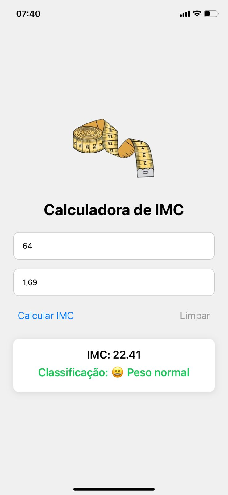
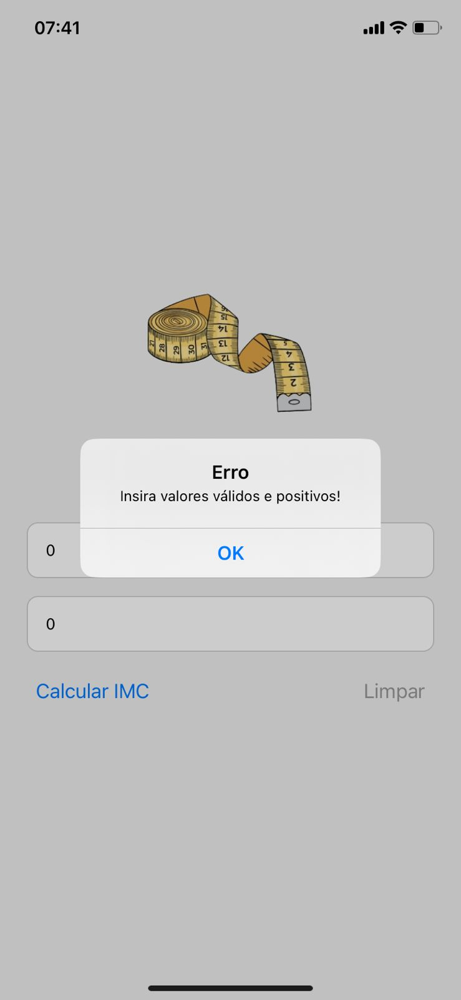

# 📱 Calculadora de IMC - React Native

Aplicativo mobile simples desenvolvido com **React Native** utilizando o **Expo**, que permite ao usuário calcular o Índice de Massa Corporal (IMC) com base no seu peso e altura.

---

## 🎯 Objetivo

Oferecer uma ferramenta prática e visual para cálculo de IMC, exibindo não só o valor, mas também a **classificação correspondente** com **cores** e **emojis**, facilitando o entendimento.

---

## 🧠 Como funciona

O IMC é calculado com a fórmula:

```

IMC = Peso(kg) / (Altura(cm) * Altura(cm))

````

Após o cálculo, o app exibe a **classificação** do IMC conforme a tabela abaixo:

| Faixa de IMC           | Classificação        | Cor           | Emoji |
|------------------------|----------------------|----------------|--------|
| Abaixo de 18,5         | Abaixo do peso       | Azul           | 😟     |
| 18,5 a 24,9            | Peso normal          | Verde          | 😄     |
| 25 a 29,9              | Sobrepeso            | Amarelo        | 😐     |
| 30 a 34,9              | Obesidade grau I     | Laranja        | 😕     |
| 35 a 39,9              | Obesidade grau II    | Vermelho       | 😟     |
| 40 ou mais             | Obesidade grau III   | Vermelho escuro| 😢     |

---

## ✨ Funcionalidades

- Entrada de **peso** e **altura**
- Cálculo do IMC com um clique
- Exibição do resultado e da classificação
- Classificação com **cores** e **emojis**
- Validação de campos (valores inválidos mostram alerta)
- Interface simples, limpa e responsiva
- Imagem decorativa acima do título

---

## 📷 Captura de Tela
### Tela principal do app com IMC calculado


### Tela principal do app com erro



---

## 🛠️ Tecnologias utilizadas

- [React Native](https://reactnative.dev/)
- [Expo](https://expo.dev/)
- Hooks (`useState`)
- Estilização com `StyleSheet`

---

## 🚀 Como executar

1. Clone o repositório:
```bash
git clone https://github.com/emillyroar/imc-calculator.git
cd imc-calculator
````

2. Instale as dependências:

```bash
npm install
```

3. Inicie o projeto:

```bash
npx expo start
```

4. Escaneie o QR Code com o app **Expo Go** no seu celular.

---

## 👩‍💻 Desenvolvedora

Feito com 💙 por **[Emilly Rodrigues](https://www.linkedin.com/in/emillyrodrigss/)**

---


